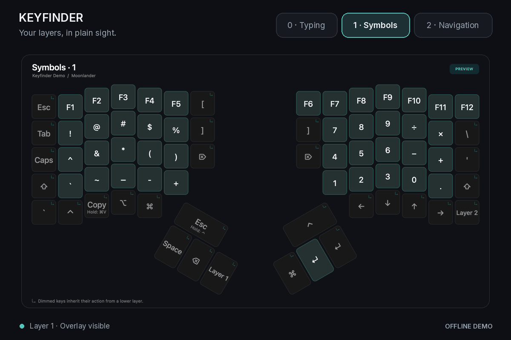

<div align="center">


# Keyfinder

</div>

> [!WARNING]
> This project is AI-generated.

<div align="center">

A macOS app that shows your keyboard’s active layer and the action assigned to each key.


[Download](../../releases/latest) · [Installation](#installation) · [Performance](#performance) · [nix-darwin](#nix-darwin) · [User guide](docs/USAGE.md)

<picture>
  <source media="(prefers-color-scheme: light)" srcset="docs/assets/demo-light.gif">
  
</picture>

*Simulated layer changes: Symbols → Navigation → Typing (overlay hidden). Static previews: [dark](docs/assets/keyboard.png) · [light](docs/assets/keyboard-light.png).*

</div>

## Features

The overlay appears on layers 1 and above and hides on layer 0. Keys float over your screen with a soft glow for contrast. It updates as you switch layers, passes clicks through, and leaves keyboard focus in your current app.

Hold **F18** to see your typing layer, then release it to return to the normal overlay. Change or disable the shortcut in **Settings → Appearance → Typing layer shortcut**. It works with the menu bar icon hidden and needs no Accessibility or Input Monitoring access.

| Feature | Behavior |
| :--- | :--- |
| Oryx synchronization | Loads the installed revision when the keyboard connects. Updates after flashing and reconnecting. |
| Keyboard layout | Model-specific layouts for Moonlander (72 keys), Voyager (52), and ErgoDox EZ (76), with tap/hold actions and Oryx key colors. |
| Appearance | Light, Dark, or System theme. Adjustable size, opacity, display, position, and delay. Optional menu bar icon. |
| Offline use | Cached layouts and a bundled three-layer demo. Layer previews in Settings. |
| Firmware | Drop a `.bin` in Settings, review it, and flash with ZSA’s Zapp. |
| Privacy | Physical keypress reports are discarded. No typing history is recorded. |

Keyfinder detects the keyboard model from USB. Oryx URLs and imported snapshots select the model for previews. It monitors one connected keyboard at a time. Voyager and ErgoDox EZ support has been checked with fixtures and rendered previews; their physical key positions and live connections remain unverified.

Oryx edits reach the live overlay after you flash them. Unflashed revisions can be previewed separately in Settings.

## Performance

Keyfinder waits for USB and system events, with no polling, repeating timers, or continuous rendering. Hidden overlays do no drawing, duplicate layer reports do no UI work, and Pause stops USB monitoring.

| Measured idle CPU | Resident memory | App bundle |
| :---: | :---: | :---: |
| **~0.0002%** of one core | **~46 MiB** | **1.9 MiB** |

Measured for the earlier Moonlander-only build over 30 seconds on Apple Silicon running macOS 26.6.2, using the Nix release build with Settings closed and no keyboard connected. These are historical measurements: they exclude startup, a connected keyboard, a visible overlay, and the newly bundled Zapp executable. [Verification details](docs/VERIFICATION.md).

Oryx is contacted only to fetch an uncached installed revision or refresh a preview. Starting without a keyboard makes no Oryx request. Zapp runs only during an explicit flash and exits afterward.

## Flash firmware

Open **Settings → Firmware** and drop the `.bin` file downloaded from Oryx, or click **Choose file…**. Check that it is for your keyboard, then click **Flash keyboard**. Dropping a file alone does not start flashing.

Connect only the keyboard you want to update. Follow Zapp’s instructions in the output panel and keep the keyboard plugged in until it finishes. Keyfinder pauses the overlay during the flash and reconnects afterward. The packaged app includes [Zapp](https://github.com/zsa/zapp); no terminal, Nix installation, or extra macOS privacy permission is needed. [Firmware guide](docs/USAGE.md#flash-firmware).

## Installation

Requires **macOS 26 or later**. [Download the latest release](../../releases/latest).

Use `Keyfinder-macOS-arm64.dmg` for Apple Silicon or `Keyfinder-macOS-x86_64.dmg` for Intel. Open the disk image, drag **Keyfinder.app** to Applications, and open it. The downloaded app does not require Nix.

On first launch, Settings shows the bundled demo. Connect your keyboard to load its installed layout, or paste an Oryx URL in **Layout & connection**.

The downloads are signed ad hoc and are not notarized. If macOS blocks opening the app, use **System Settings → Privacy & Security → Open Anyway** after attempting to open it.

### Build with Nix

From a checkout with [Nix flakes enabled](https://nix.dev/concepts/flakes):

```sh
nix build
open result/Applications/Keyfinder.app
```

Use `nix run` to build and launch directly.

The flake pins Nixpkgs, Swift, and the macOS SDK for Apple Silicon and Intel. Nix downloads the toolchain, so you do not need a separate Xcode or Command Line Tools installation. [Packaging and reproducibility](docs/NIX.md#reproducibility).

```sh
nix build .#dmg --out-link result-dmg # A disk image containing the standalone .app
nix run . -- --diagnostics          # Check the packaged app and bundled layout
nix run . -- --background           # Start without opening Settings
```

Pushing a Git tag builds and checks both architectures, then uploads their disk images to GitHub Releases. [Release workflow](docs/NIX.md#tag-releases).

## nix-darwin

The flake provides a nix-darwin module. A complete system flake that installs Keyfinder and starts it at login:

```nix
{
  inputs = {
    nixpkgs.url = "github:NixOS/nixpkgs/nixpkgs-26.05-darwin";
    nix-darwin.url = "github:nix-darwin/nix-darwin/nix-darwin-26.05";
    nix-darwin.inputs.nixpkgs.follows = "nixpkgs";
    keyfinder.url = "github:emileakbarzadeh/keyfinder";
  };

  outputs = { nix-darwin, keyfinder, ... }: {
    darwinConfigurations.my-mac = nix-darwin.lib.darwinSystem {
      modules = [
        keyfinder.darwinModules.default
        {
          nixpkgs.hostPlatform = "aarch64-darwin"; # "x86_64-darwin" on Intel
          system.primaryUser = "your-username";
          system.stateVersion = 6;
          services.keyfinder.enable = true;
        }
      ];
    };
  };
}
```

Apply it with `sudo darwin-rebuild switch --flake .#my-mac`. In an existing configuration, add the `keyfinder` input, `keyfinder.darwinModules.default`, and `services.keyfinder.enable = true`. Keyfinder builds with its own pinned Nixpkgs, so don't make its `nixpkgs` input follow yours.

Keyfinder is installed in **Applications → Nix Apps** and starts at login for the primary user. Quitting stops it until the next login or service reload.

| Option | Default | Purpose |
| :--- | :--- | :--- |
| `services.keyfinder.enable` | `false` | Install Keyfinder. |
| `services.keyfinder.startAtLogin` | `true` | Create a user LaunchAgent. Set `false` to launch manually. |
| `services.keyfinder.package` | The flake’s package | Select another compatible Keyfinder build. |

When the module handles startup, leave the app’s “Launch Keyfinder at login” toggle off. [Module details](docs/NIX.md#nix-darwin-module).

## Settings

<picture>
  <source media="(prefers-color-scheme: light)" srcset="docs/assets/appearance-light.png">
  
</picture>

Choose **Appearance → Color theme → System, Light, or Dark**. System follows macOS automatically. The theme applies to Settings and the overlay.

Settings lets you preview layers, inspect key actions, and drag the overlay into position. The overlay accepts clicks while arranging; it passes them through when you finish.

To hide the menu bar icon, turn off **Appearance → Show menu bar icon**. Open Keyfinder from Applications or Spotlight to show Settings again. Hiding the icon leaves the overlay running. Login and background launches leave Settings closed.

Transparent keys can inherit different actions from stacked layers. Stock Oryx reports only the highest active layer, so Keyfinder shows alternatives such as `1 / F1` when the exact action is ambiguous. [User guide and troubleshooting](docs/USAGE.md).

## Development

```sh
nix flake check                    # Build + offline core checks + module checks
nix run .#smoke-test               # AppKit integration checks; opens temporary windows
nix run .#firmware-checks          # File handling and flashing lifecycle with a fake backend
nix run .#previews                 # Render all bundled layers into artifacts/previews
nix run .#demo                     # Generate the animated demo in artifacts/demo.gif
nix run .#benchmark -- --seconds 30 # Measure the packaged app from a separate process
nix develop                       # Pinned compiler, SDK, Python, and Nix formatter
nix fmt
```

The Swift core handles layouts, labels, USB packet decoding, and caching. AppKit, SwiftUI, and IOKit provide macOS integration. There are no third-party Swift package dependencies. The core is separate from the macOS adapter for a possible Linux port.

USB pairing, physical layer changes, and flash/reconnect behavior have not yet been tested with physical keyboards. Checks use protocol fixtures and simulated USB events. A live Oryx fetch was verified for the earlier Moonlander build. [Verification record](docs/VERIFICATION.md).

[Contributing](CONTRIBUTING.md) · [User guide](docs/USAGE.md) · [Nix packaging](docs/NIX.md) · [Verification](docs/VERIFICATION.md)

## License

Copyright © 2026 the Keyfinder contributors.

Keyfinder is free software: you can redistribute and modify it under the terms of the [GNU General Public License](LICENSE), version 3 or (at your option) any later version. It comes with no warranty.

Release downloads include ZSA's [Zapp](https://github.com/zsa/zapp), which has its own license (MIT with the Commons Clause). That license ships inside the app under `Contents/Resources/Licenses/Zapp`.

Inspired by [corncheese](https://github.com/conroy-cheers). Built for [ZSA keyboards](https://www.zsa.io/), using its [Oryx protocol](https://github.com/zsa/qmk_modules/tree/main/oryx). Keyfinder is an independent project.
