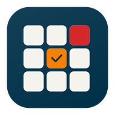
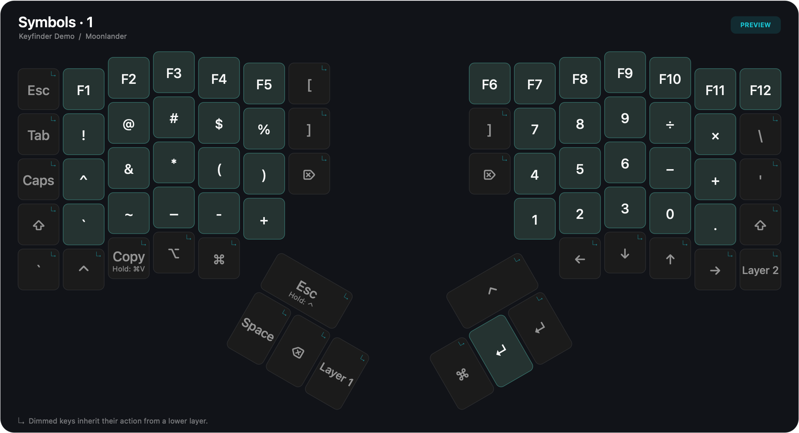
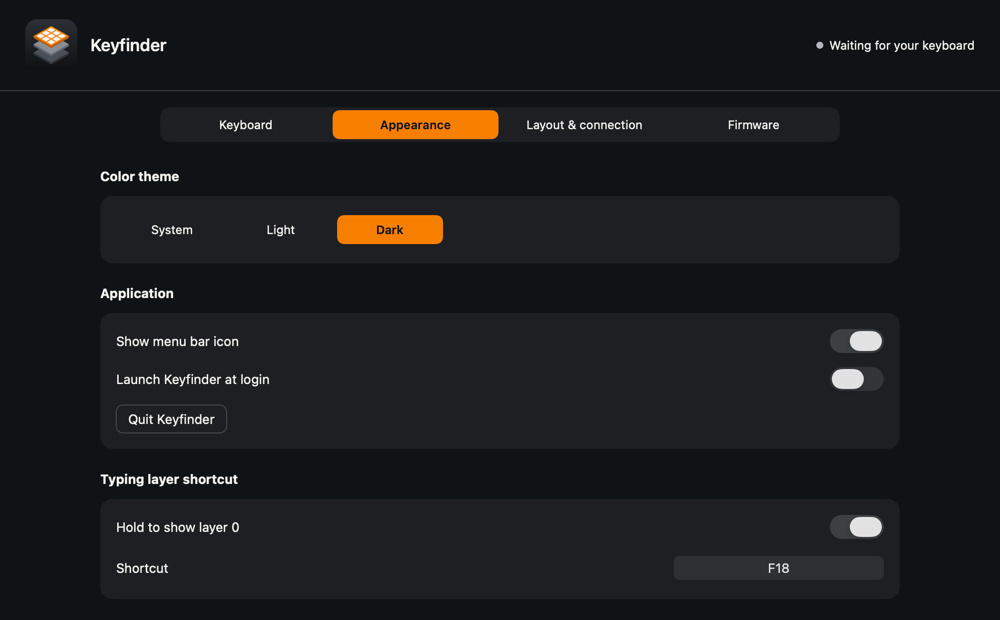

<div align="center">



# Keyfinder

> [!WARNING]
> This project is AI-generated.

**Your Moonlander’s layers, in plain sight.**

A quiet macOS menu bar app that shows what every key does, right when you need it.


[Download latest release](../../releases/latest) · [Get started](#get-started) · [Performance](#small-app-quiet-idle) · [nix-darwin](#add-it-to-nix-darwin) · [How it works](docs/USAGE.md)



*Actual app preview with a synthetic demo layout. Connect a Moonlander to load its installed Oryx revision.*

</div>

## Find the key. Keep your flow.

Switch to a layer above **0** and your keyboard appears on screen. Change layers and the legends follow. Return to your typing layer and it disappears. Clicks pass through; your work keeps keyboard focus.

| Feature | What you get |
| :--- | :--- |
| **Your layout, automatically** | Reads the installed Oryx revision when your Moonlander connects. Flash a new configuration and the overlay follows on reconnect. |
| **Made for the Moonlander** | All 72 keys, the split shape, angled thumb clusters, tap/hold actions, and Oryx key colors. |
| **Comfortably out of the way** | Set size, opacity, display, position, and an optional appearance delay. Hide the menu bar icon for an even quieter desktop; reopen the app to reach Settings. |
| **Useful offline** | Cached layouts and a bundled three-layer example work without a network connection. Inspect any layer in Settings. |
| **No typing history** | Uses the keyboard’s layer messages. Physical keypress reports are discarded immediately. |

Oryx edits take effect in the live overlay **after you flash them**. You can preview an unflashed revision separately without changing what the live overlay shows.

## Small app. Quiet idle.

Keyfinder waits for device and system events. It has **no polling, no repeating timers, and no continuous rendering**. Hidden overlays do no drawing, repeated layer reports do no UI work, and Pause stops USB monitoring.

| Measured idle CPU | Resident memory | App bundle |
| :---: | :---: | :---: |
| **~0.0002%** of one core | **~47 MiB** | **2.1 MiB** |

Observed over 30 seconds on Apple Silicon running macOS 26.6.2, using the Nix-built release app with Settings closed and the keyboard unplugged; startup excluded. These are observations from that configuration, not a bound on connected-device or active-overlay usage. The app size excludes build tools. [Read the measurements and test coverage →](docs/VERIFICATION.md)

There is no periodic Oryx refresh. A layout download happens only for an uncached installed revision or when you request a preview refresh. Starting unplugged makes no Oryx request.

## Get started

Requires **macOS 26 or later**. [Download the latest release →](../../releases/latest)

Choose `Keyfinder-macOS-arm64.dmg` for Apple Silicon or `Keyfinder-macOS-x86_64.dmg` for Intel. Open the disk image, drag **Keyfinder.app** to Applications, and open it. Settings opens with a synthetic offline demo. Connect your Moonlander to load its installed layout, or paste an Oryx URL in **Layout & connection**. Nix is not required to run the downloaded app.

The downloads are signed ad hoc and are not notarized. If macOS blocks opening the app, use **System Settings → Privacy & Security → Open Anyway** after attempting to open it. If macOS requests Input Monitoring access, grant it to Keyfinder and retry the connection from Settings.

Prefer a reproducible source build? With [Nix and flakes enabled](https://nix.dev/concepts/flakes), run from a checkout:

```sh
nix build
open result/Applications/Keyfinder.app
```

Or launch directly with `nix run`.

The flake pins Nixpkgs, the Apple Swift toolchain, and the macOS SDK. You do not need to install Xcode or Command Line Tools separately. The first build downloads the toolchain; later builds reuse the Nix store. Packages are defined for Apple Silicon and Intel Macs.

The signed app, compiled launcher, and disk image are built from pinned inputs. [Rebuild comparisons and verification →](docs/NIX.md#reproducibility)

```sh
nix build .#dmg --out-link result-dmg # A disk image containing the standalone .app
nix run . -- --diagnostics          # Check the packaged app and bundled layout
nix run . -- --background           # Start without opening Settings
```

Pushing a Git tag builds and checks both architectures, then publishes the disk images to GitHub Releases. [Release workflow and signing details →](docs/NIX.md#tag-releases)

## Add it to nix-darwin

Add your Keyfinder checkout as a flake input to an existing nix-darwin configuration. Replace the example path with the checkout’s absolute path:

```nix
{
  inputs.keyfinder.url = "path:/absolute/path/to/keyfinder";

  outputs = { nix-darwin, keyfinder, ... }: {
    darwinConfigurations.your-mac = nix-darwin.lib.darwinSystem {
      modules = [
        keyfinder.darwinModules.default
        {
          system.primaryUser = "your-username";
          services.keyfinder.enable = true;
        }
      ];
    };
  };
}
```

Keep your existing inputs and modules, then rebuild your nix-darwin configuration as usual. Keyfinder appears in **Applications → Nix Apps** and starts in the primary user’s graphical login session. **Quit stays quit** until the next login or service reload.

| Option | Default | Purpose |
| :--- | :--- | :--- |
| `services.keyfinder.enable` | `false` | Install the app and enable module configuration. |
| `services.keyfinder.startAtLogin` | `true` | Create a user LaunchAgent. Set `false` to launch manually. |
| `services.keyfinder.package` | The flake’s package | Select another compatible Keyfinder build. |

When the module handles startup, leave the app’s own “Launch Keyfinder at login” toggle off. [Nix outputs, reproducibility, and module details →](docs/NIX.md)

## Make it yours



Preview layers, inspect individual actions, or drag the overlay into position. The live overlay resumes passing clicks through when you finish arranging.

To hide the menu bar icon, turn off **Appearance → Show menu bar icon**. Open Keyfinder from Applications or Spotlight to return to Settings, even when it is already running. Background startup stays quiet, and the overlay continues to follow your layers.

Transparent keys can inherit different actions from stacked layers. Stock Oryx reports only the highest active layer, so Keyfinder shows alternatives such as **`1 / F1`** when the exact action is ambiguous. [Details and connection troubleshooting →](docs/USAGE.md)

## Build, check, contribute

```sh
nix flake check                    # Build + offline core checks + module checks
nix run .#smoke-test                # AppKit integration checks; opens temporary windows
nix run .#previews                  # Render all bundled layers into artifacts/previews
nix run .#benchmark -- --seconds 30 # Measure the packaged app from a separate process
nix develop                        # Pinned compiler, SDK, Python, and Nix formatter
nix fmt
```

The Swift core covers layouts, labels, USB packet decoding, and caching. AppKit, SwiftUI, and IOKit handle the Mac integration. There are no third-party Swift package dependencies. The core is separated from the desktop adapter to leave room for a future Linux port.

Physical Moonlander pairing, real layer changes, and flash/reconnect behavior still need hardware acceptance testing. The current verification uses protocol fixtures, simulated USB events, and a live Oryx revision fetch. [Full verification record →](docs/VERIFICATION.md)

[Architecture](docs/ARCHITECTURE.md) · [Contributing](CONTRIBUTING.md) · [User guide](docs/USAGE.md) · [Nix packaging](docs/NIX.md)

Built for [ZSA’s Moonlander](https://www.zsa.io/moonlander), using its [Oryx protocol](https://github.com/zsa/qmk_modules/tree/main/oryx). Keyfinder is an independent project.
